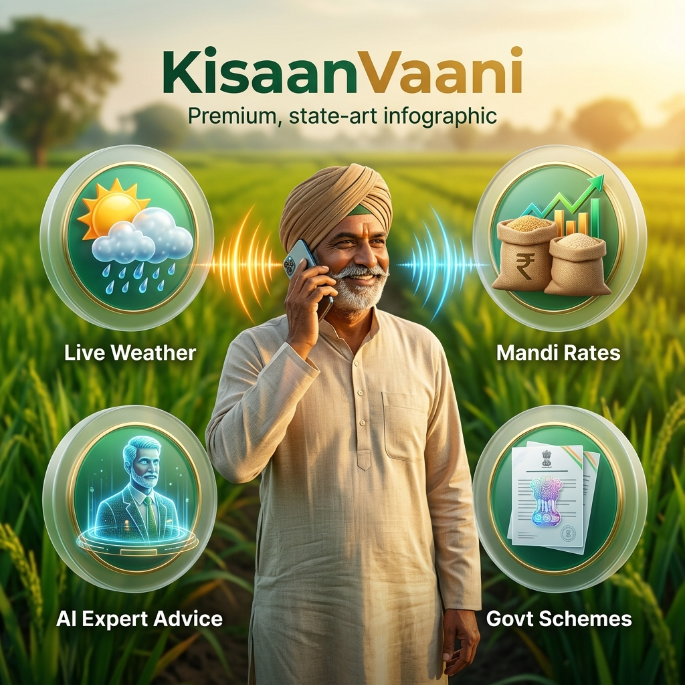
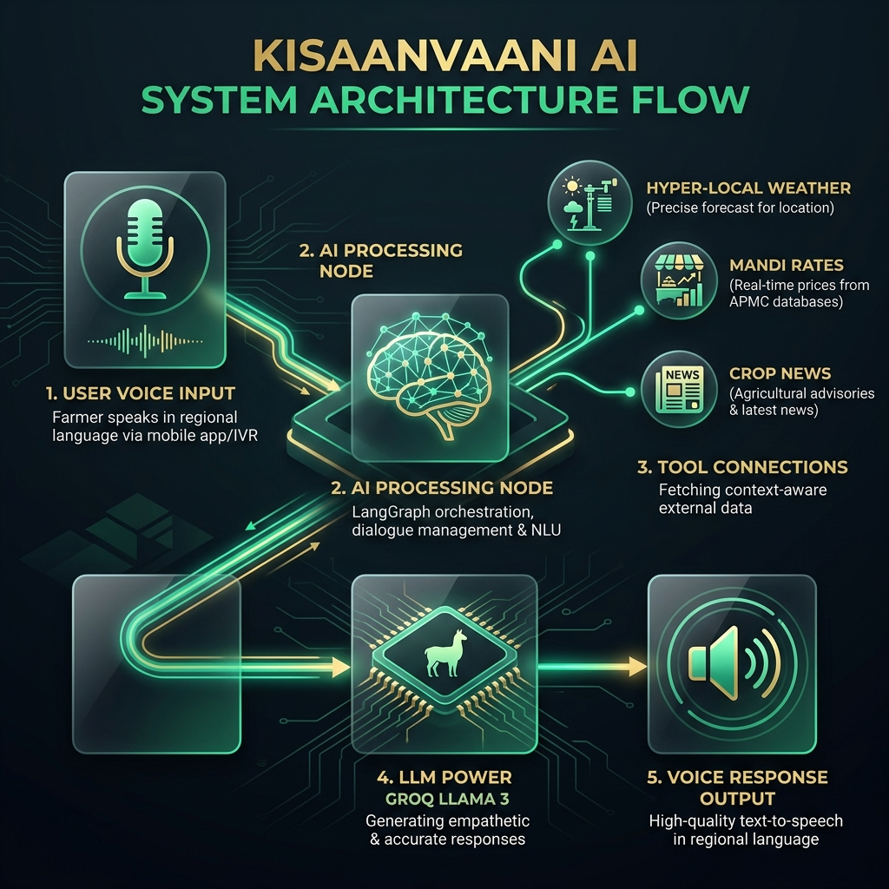
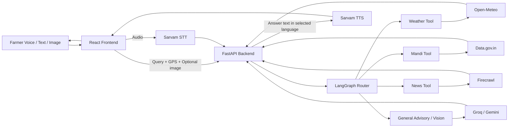

# 🌾 KisaanVaani AI

> Voice-first AI assistant for Indian farmers (multilingual speech, weather, mandi, schemes, and crop advisory).



[](https://www.python.org/downloads/)
[](https://react.dev/)
[](https://fastapi.tiangolo.com/)
[](https://www.netlify.com/)
[](https://render.com/)
[](https://opensource.org/licenses/MIT)

---

## ✨ What this project does

KisaanVaani lets a farmer speak naturally (Hindi/regional language), sends speech to text, routes the query to the right agriculture tool, and replies back in selected language with voice.

Core capabilities:
- 🎙️ **Speech in, speech out** (Sarvam STT + TTS)
- 🌦️ **Live weather intelligence** (GPS-aware + rain probability guidance)
- 💹 **Mandi insights** (Data.gov.in + location context)
- 📰 **Latest agriculture updates** (Firecrawl)
- 👨‍🌾 **Advisory responses** (LangGraph + Groq reasoning with tool routing)
- 🖼️ **Photo-assisted crop analysis** (Gemini vision path)

---

## 🧭 Architecture





---

## 🔌 API overview

| Area | Endpoint | Purpose |
|---|---|---|
| Health | `GET /` | Root status |
| Health | `GET /health` | Health probe |
| Auth | `POST /api/auth/otp/send` | Send OTP |
| Auth | `POST /api/auth/otp/verify` | Verify OTP + login/register |
| Auth | `GET /api/auth/me` | Current user |
| Auth | `POST /api/auth/refresh` | Refresh token |
| Auth | `POST /api/auth/profile/update` | Update district/state/city/lat/lon |
| Agent | `POST /api/agent/chat` | Main AI endpoint |
| Agent | `POST /api/agent/mandis/nearby` | Nearby mandi list by coordinates |
| Voice | `POST /api/voice/transcribe` | Audio → transcript + english_transcript |
| Voice | `POST /api/voice/speak` | Text → WAV audio |

---

## 🛠️ Tech stack

| Layer | Stack |
|---|---|
| Frontend | React 19, Vite, Axios |
| Backend | FastAPI, Pydantic, LangGraph |
| AI | Groq (LLM), Gemini Vision, Sarvam (STT/TTS/translate) |
| Data Tools | Open-Meteo, Data.gov.in, Firecrawl |
| Storage | Supabase (users/messages/session context) |
| Deployment | Netlify (frontend), Render (backend) |

---

## 📁 Project structure

```text
KisaanVaani--AI/
├── backend/
│   ├── app/
│   │   ├── agents/         # Routing graph + weather/mandi/news tools
│   │   ├── routers/        # auth, voice, agent, history endpoints
│   │   ├── lib/            # translation helpers
│   │   └── main.py         # FastAPI app entry
│   └── requirements.txt
├── frontend/
│   ├── src/
│   │   ├── components/
│   │   ├── context/
│   │   └── api.js
│   └── package.json
├── Manual Testers/         # scenario and API testing scripts
└── docs/assets/            # README images/diagrams
```

---

## 🚀 Local setup

### 1) Backend
```bash
cd backend
python -m venv venv
# Windows: venv\Scripts\activate
# Linux/macOS: source venv/bin/activate
pip install -r requirements.txt
uvicorn app.main:app --reload
```

### 2) Frontend
```bash
cd frontend
npm install
npm run dev
```

### 3) Environment (`backend/.env`)
```env
GROQ_API_KEY=
GEMINI_API_KEY=
SARVAM_API_KEY=
FIRECRAWL_API_KEY=
DATAGOV_API_KEY=
OPENWEATHER_API_KEY=
SUPABASE_URL=
SUPABASE_SERVICE_KEY=
SECRET_KEY=
```

---

## 🧪 Manual testing

```bash
python "./Manual Testers/test_tools_logic.py"
python "./Manual Testers/test_live_mandis_and_agent.py"
```

For deployed backend testing:
```powershell
$env:BASE_URL="https://kisaanvaani-ai-1.onrender.com"
python "./Manual Testers/test_live_mandis_and_agent.py"
```

---

## 🌍 Supported response languages

**Hindi • Punjabi • Bengali • Tamil • Telugu • Kannada • Malayalam • Marathi • Gujarati • Odia • English (India)**

---

Built with ❤️ for Indian farmers.
