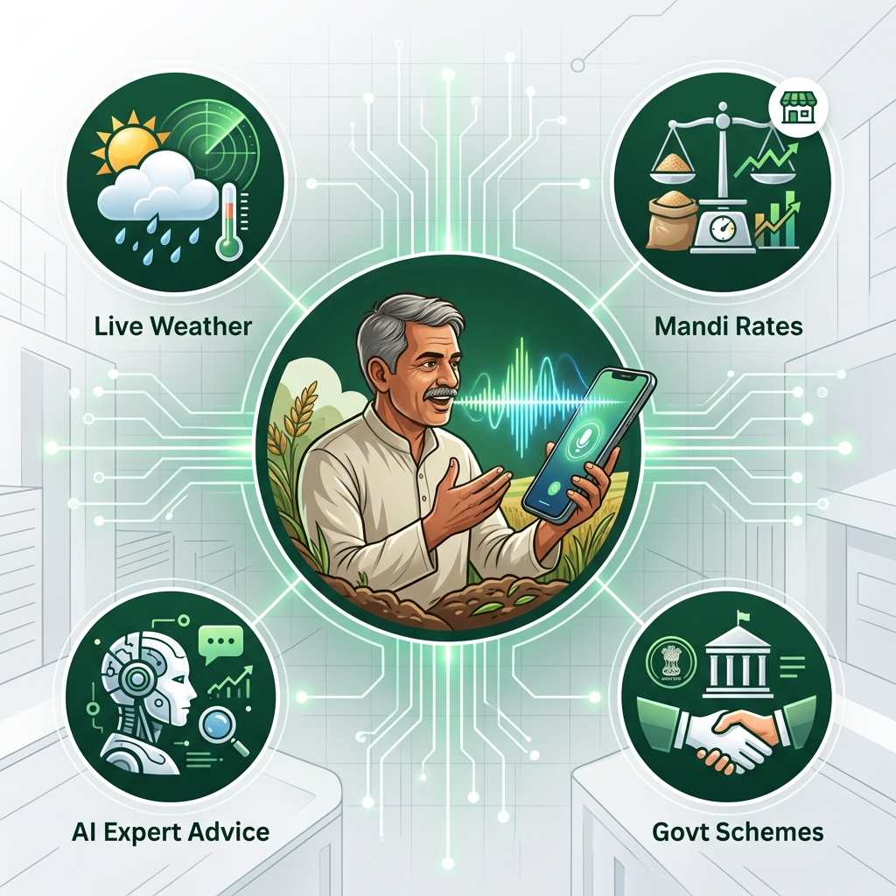
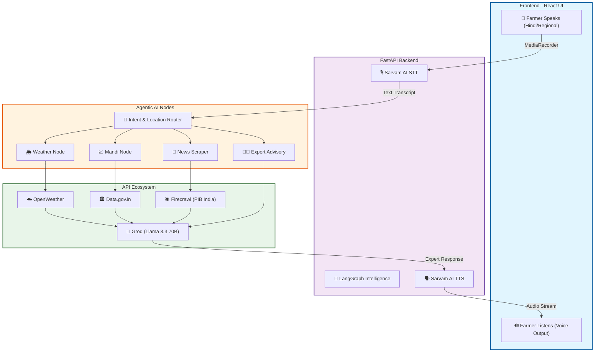

# 🌾 KisaanVaani AI — Voice-First AI Assistant for Indian Farmers



[](https://www.python.org/downloads/)
[](https://react.dev/)
[](https://fastapi.tiangolo.com/)
[](https://opensource.org/licenses/MIT)

---

## 📌 Project Vision
KisaanVaani is a **premium, voice-first AI ecosystem** designed to bridge the digital gap for Indian farmers. By enabling natural language interaction in 12+ regional languages, we empower farmers to access world-class agricultural expertise without ever needing to type.

## 🚀 Key Features
- 🎙️ **Multi-Lingual Voice First**: Speak in Hindi, Punjabi, Tamil, etc., and get voice responses back.
- 💰 **Live Mandi Rates**: Real-time prices from **Data.gov.in** across any district in India.
- 🌦️ **Agricultural Weather**: Hyper-local weather forecasting tuned for farming decisions.
- 📰 **Live News Scraper**: Real-time agricultural updates and policy changes via **Firecrawl**.
- 👨‍🔬 **Expert Senior Scientist Persona**: AI responses are driven by a "Senior Agricultural Scientist" persona, providing deep "why" and "how" advice.
- 📋 **Scheme Advisory**: Detailed eligibility and application guidance for PM-Kisan, PMFBY, and more.

---

## 🔄 System Architecture & Flow



---

## 🛠️ Tech Stack & Integration

### ⚙️ The Brain (AI & Logic)
| Service | Purpose |
|---|---|
| **LangGraph** | Multi-node agentic workflow and state management. |
| **Groq (Llama 3.3 70B)** | High-speed LLM inference for expert agricultural reasoning. |
| **Sarvam AI** | Industry-leading STT (Saarika) and TTS (Bulbul) for Indian languages. |
| **Firecrawl API** | Advanced web scraping for latest govt schemes and press releases. |

### 🌐 The Core (Backend & Frontend)
| Tech | Role |
|---|---|
| **FastAPI** | High-performance asynchronous API layer. |
| **React 19** | Modern, responsive UI with real-time audio visualization. |
| **MongoDB Atlas** | Secure storage for farmer profiles and multi-session chat history. |
| **Open-Meteo** | Real-time geospatial weather data processing. |

---

## 📂 Project Structure
```text
KisaanVaani-AI/
├── 📁 Manual Testers/       # Tools for verifying API connectivity & logic
│   ├── debug_mandi.py       # Raw Data.gov.in API debugger
│   └── test_tools_logic.py  # Full intent-routing verification script
├── 📁 backend/              # FastAPI Server
│   ├── 📁 app/
│   │   ├── 📁 agents/       # LangGraph nodes & Tool logic
│   │   ├── 📁 routers/      # Voice, Auth, and Agent endpoints
│   │   └── config.py        # Pydantic Settings & Env management
├── 📁 frontend/             # React Application
│   └── 📁 src/
│       ├── 📁 components/   # UI Modules (Hero, Auth, Chat)
│       └── api.js           # Central API client
└── .env                     # Global Environment configuration
```

---

## 🚀 Getting Started

### 1. Backend Setup
```bash
cd backend
python -m venv venv
source venv/bin/activate  # Or venv\Scripts\activate on Windows
pip install -r requirements.txt
```

### 2. Environment Variables
Create a `.env` file in the `backend` folder:
```env
# AI & Tools
GROQ_API_KEY=gsk_...
SARVAM_API_KEY=sk_...
FIRECRAWL_API_KEY=fc-...
DATAGOV_API_KEY=your_key_from_data_gov_in

# Database & Auth
MONGODB_URI=your_mongodb_uri
SECRET_KEY=kisaanvaani_secret_key
```

### 3. Run the System
**Backend:**
`uvicorn app.main:app --reload`

**Frontend:**
`npm run dev`

---

## 👨‍💻 Manual Testing
To verify the system's intelligence without using the voice interface, we provide specialized tools in the `Manual Testers` folder:
```bash
# To test the full AI logic (Weather, Mandi, News, Expert Advice)
python "./Manual Testers/test_tools_logic.py"
```

---

## 🌍 Supported Languages
**Hindi • Punjabi • Bengali • Tamil • Telugu • Kannada • Malayalam • Marathi • Gujarati • Odia • English (Indian)**

---
Developed with ❤️ for Indian Farmers.
