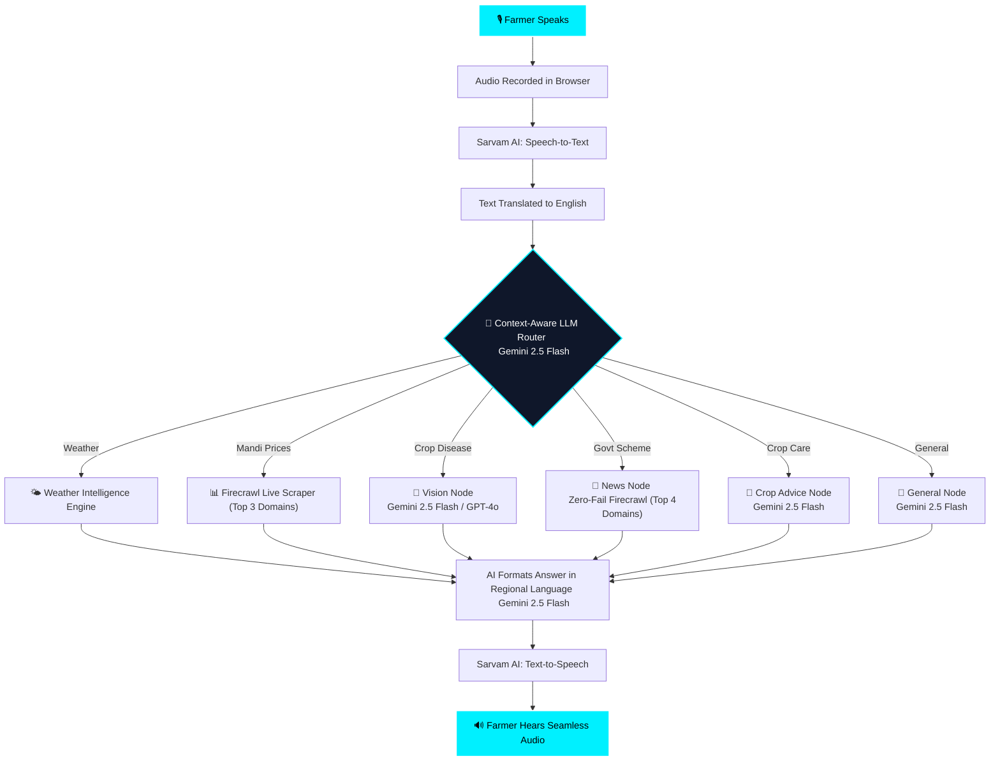
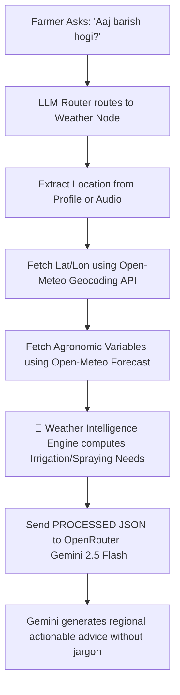
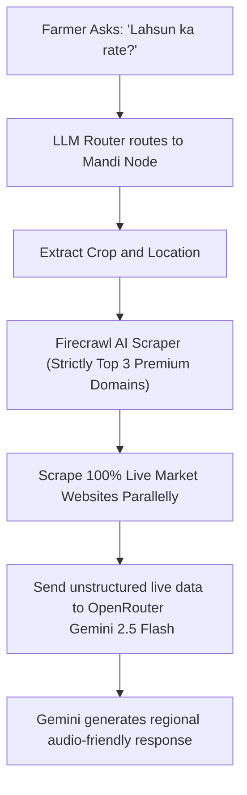
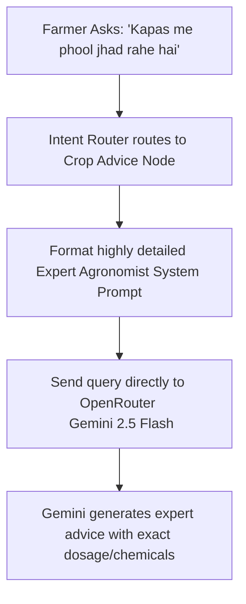
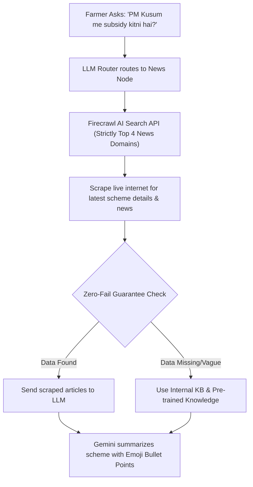
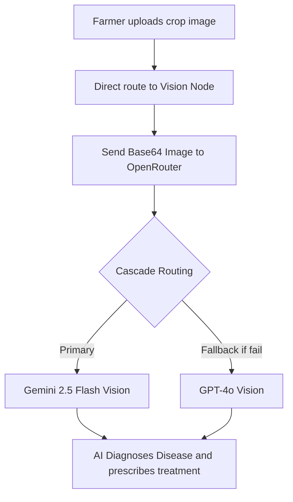

<p align="center">
  
</p>

<h1 align="center">🌾 KisaanVaani — AI Voice Assistant for Indian Farmers</h1>

<p align="center">
  <b>Empowering 150M+ Indian farmers with a Seamless Voice-First AI — featuring Real-Time Hybrid Scrapers, Multi-Model Cascades, and Context-Aware Intelligence.</b>
</p>

<p align="center">
  
  
  
  
  
  
</p>

---

## 📋 Table of Contents

- [Overview](#-overview)
- [Key Features](#-key-features)
- [System Architecture](#-system-architecture)
- [Tech Stack](#-tech-stack)
- [Project Structure](#-project-structure)
- [Setup & Installation](#-setup--installation)
- [API Endpoints](#-api-endpoints)
- [How It Works (Mermaid Flow)](#-how-it-works)
- [Node Deep-Dives](#-node-deep-dives)
- [Supported Languages](#-supported-languages)
- [Team](#-team)

---

## 🎯 Overview

**KisaanVaani** is a state-of-the-art, voice-first AI assistant designed specifically for Indian farmers. Wrapped in a stunning **Premium Dark Electric Blue Theme**, it provides immediate, real-time agricultural intelligence. Instead of typing, farmers simply **speak** their questions in their native language and receive **spoken answers**. 

> *"Agar kisan bol sakta hai, toh KisaanVaani samajh sakta hai."*
> — If a farmer can speak, KisaanVaani can understand.

### 🚀 Problem Statement
- **70% of Indian farmers** cannot easily navigate text-based apps
- Weather, market prices, and government schemes are scattered and often outdated
- Language barriers prevent access to expert agricultural advice

### 💡 Our Solution
A **single voice command** gives farmers instant access to:
- 🌤️ **Real-time weather** forecasts for their district
- 📊 **Hybrid Mandi Prices** (Official Agmarknet + Live Firecrawl AI Scraper)
- 🌱 **Expert crop disease diagnosis** via photo upload (OpenRouter Vision Cascade)
- 📜 **Government schemes** eligibility & registration help
- 🗣️ All seamlessly delivered with **uninterrupted audio streaming**

---

## ✨ Key Features

| Feature | Description |
|---------|-------------|
| 🎙️ **Seamless Voice-First UI** | Speak naturally. Audio streaming supports immediate interruption & smart caching. |
| 🌐 **11 Indian Languages** | Hindi, Punjabi, Bengali, Tamil, Telugu, Kannada, Malayalam, Marathi, Gujarati, Odia, Assamese. |
| 🌤️ **Live Weather** | Real-time forecasts using Open-Meteo API. |
| 📈 **Hybrid Mandi Engine** | Fuses *data.gov.in* base prices with **Firecrawl Live Web Scraping** for 100% free, real-time rates. |
| 📸 **Crop Disease Detection** | Upload a photo → AI identifies disease + treatment via OpenRouter Vision Cascade. |
| 🧠 **Context-Aware Logic** | AI automatically detects user's location from their profile if they don't mention a district in their voice query. |
| 🎨 **Premium UI/UX** | Dark Electric Blue theme, glassmorphism UI, audio visualizers, and zero-latency mic interactions. |
| 🔐 **OTP Authentication** | Secure phone-based login via Supabase. |

---

## 🔄 How It Works



---

## 🔍 Node Deep-Dives

Detailed architectural flows for how each core AI node processes information before returning it to the user.

### 🌤️ Weather Node


### 📊 Mandi Node


### 🌿 Crop Advice Node


### 📜 News & Scheme Node


### 📸 Vision Node (LLM Cascade)


---

## 🛠️ Tool Output Samples (Behind the Scenes)

Below are exact examples of the data our backend tools generate and pass to the AI LLM. This structured intelligence allows the AI to provide highly accurate, hallucination-free advice.

### 1. Weather Intelligence Engine Output (`get_weather`)
```json
{
  "temperature": 38.1,
  "humidity": 40,
  "rain_probability": 33,
  "wind_speed": 9.6,
  "uv_index": 6.15,
  "soil_temperature": 31.5,
  "soil_moisture": 0.13,
  "evapotranspiration": 3.2,
  "irrigation_needed": false,
  "spraying_recommended": false,
  "harvest_recommended": false,
  "fungal_disease_risk": "Low",
  "heat_stress": "High",
  "wind_risk": "Low",
  "crop_water_requirement": "Medium",
  "weather_confidence": 92
}
```

### 2. Live Mandi Scraper Output (`get_mandi_price`)
```text
(Live Extracted Text from Top 3 Trusted Domains via Firecrawl)
...
"Mustard (Sarson) market price in Ludhiana Mandi today is ₹5,470 per quintal.
Arrivals are expected to be normal. Market trend is stable."
...
```

### 3. Scheme & News Scraper Output (`scrape_agricultural_news`)
```text
(Live Extracted Text from Top 4 Trusted Domains + Zero Fail Internal KB)
...
"PM Kisan 17th Installment Date: The 17th installment of PM Kisan Samman Nidhi
will be released on 18th June 2024. e-KYC is mandatory before 15th June.
Farmers can complete e-KYC via CSC centers or PM Kisan Portal."
...
```

---

## 🔧 Tech Stack

### Frontend
| Technology | Purpose |
|-----------|---------|
| **React 18** | UI Framework |
| **Vite** | Build Tool & Dev Server |
| **Lucide React** | Icon Library |
| **Vanilla CSS** | Premium Dark Glassmorphism Styling |
| **Web Audio API** | Real-time mic recording & visualizers |

### Backend
| Technology | Purpose |
|-----------|---------|
| **FastAPI** | REST API Server |
| **LangGraph** | AI Agent Orchestration |
| **OpenRouter (Cascade)** | Premium Text & Vision Models |
| **Sarvam AI** | Speech-to-Text & Text-to-Speech |
| **Open-Meteo** | Weather Forecasts |
| **data.gov.in** | Baseline Mandi Price Data |
| **Firecrawl** | Real-Time Web Scraping for Live Mandi Rates & Schemes |
| **Supabase** | Database & Authentication |

---

## ⚡ Setup & Installation

### Prerequisites
- **Python 3.11+**
- **Node.js 18+**
- **npm** or **yarn**

### 1️⃣ Clone the Repository
```bash
git clone https://github.com/Satyam2006chh/KisaanVaani--AI.git
cd KisaanVaani--AI
```

### 2️⃣ Backend Setup
```bash
cd backend
python -m venv .venv
.venv\Scripts\activate          # Windows
# source .venv/bin/activate     # Mac/Linux

pip install -r requirements.txt
```

### 3️⃣ Configure Environment Variables
Create `backend/.env`:
```env
OPENROUTER_API_KEY=your_openrouter_key
SARVAM_API_KEY=your_sarvam_key
SUPABASE_URL=your_supabase_url
SUPABASE_SERVICE_KEY=your_supabase_key
DATAGOV_API_KEY=your_datagov_key
FIRECRAWL_API_KEY=your_firecrawl_key
```

### 4️⃣ Fast Start (Windows)
Instead of starting the backend and frontend manually in separate terminals, we have provided a 1-click fast start script!

Run this in your PowerShell terminal at the root of the project:
```powershell
.\run.ps1
```
This will automatically:
1. Clear any stuck ports (8000, 5174)
2. Open a new terminal and start the FastAPI Backend
3. Open a new terminal and start the React Frontend

### 5️⃣ Open in Browser
```
http://localhost:5174
```

---

## 🛡️ Security

- 🔐 **OTP-based authentication** — No passwords stored
- 🔑 **API keys stored in `.env`** — Never committed to git
- 🛡️ **CORS protection** — Only allowed origins can access APIs
- 📝 **Input sanitization** — All user inputs are validated

---

## 📊 Performance

| Metric | Value |
|--------|-------|
| Speech-to-Text Latency | ~1.5s |
| AI Response Time | ~2-3s |
| Text-to-Speech Streaming | ~1s (Continuous background prefetch) |
| Total Round Trip | ~4-6s |

---

<p align="center">
  <b>🌾 KisaanVaani — Har Kisan Ki Awaaz, Har Sawaal Ka Jawaab 🌾</b>
  <br/>
  <i>Every Farmer's Voice, Every Question's Answer</i>
</p>
