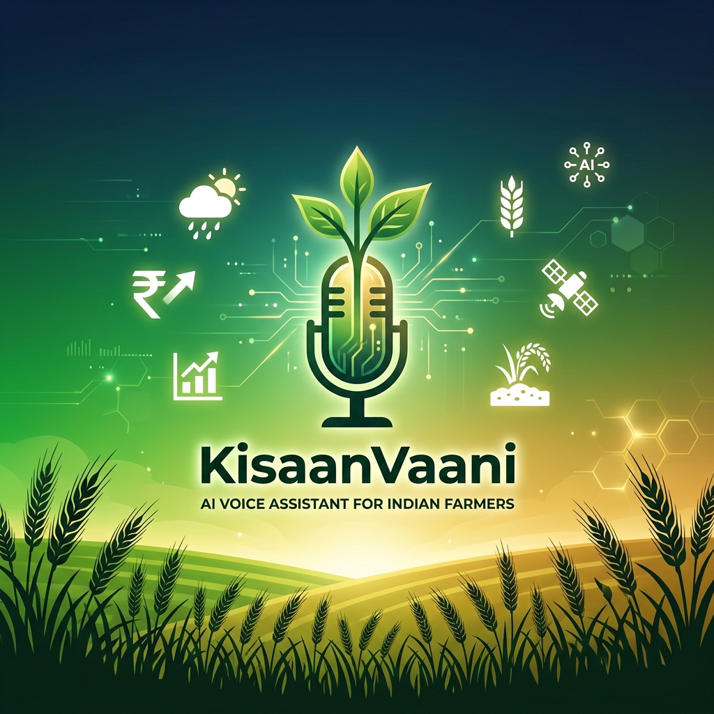
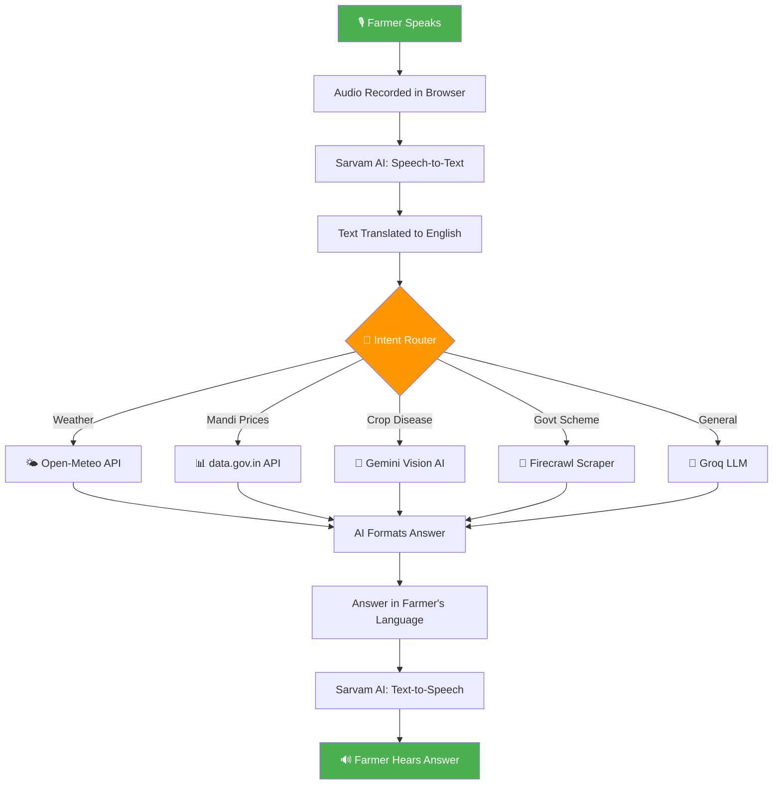

<p align="center">
  
</p>

<h1 align="center">🌾 KisaanVaani — AI Voice Assistant for Indian Farmers</h1>

<p align="center">
  <b>Empowering 150M+ Indian farmers with voice-first, multilingual AI — powered by real-time weather, mandi prices, and expert crop advice.</b>
</p>

<p align="center">
  
  
  
  
  
</p>

---

## 📋 Table of Contents

- [Overview](#-overview)
- [Key Features](#-key-features)
- [System Architecture](#-system-architecture)
- [Tech Stack](#-tech-stack)
- [Project Structure](#-project-structure)
- [Setup & Installation](#-setup--installation)
- [API Endpoints](#-api-endpoints)
- [How It Works](#-how-it-works)
- [Supported Languages](#-supported-languages)
- [Team](#-team)

---

## 🎯 Overview

**KisaanVaani** is a voice-first AI assistant designed specifically for Indian farmers who may have limited literacy or tech experience. Instead of typing, farmers simply **speak** their questions in their native language and receive **spoken answers** — making advanced agricultural intelligence accessible to everyone.

> *"Agar kisan bol sakta hai, toh KisaanVaani samajh sakta hai."*
> — If a farmer can speak, KisaanVaani can understand.

### 🚀 Problem Statement
- **70% of Indian farmers** cannot easily navigate text-based apps
- Weather, market prices, and government schemes are scattered across multiple websites
- Language barriers prevent access to expert agricultural advice

### 💡 Our Solution
A **single voice command** gives farmers instant access to:
- 🌤️ Real-time weather forecasts for their district
- 📊 Live mandi (market) prices for their crops
- 🌱 Expert crop disease diagnosis via photo upload
- 📜 Government scheme eligibility & registration help
- 🗣️ All in their **native language** (11 languages supported)

---

## ✨ Key Features

| Feature | Description |
|---------|-------------|
| 🎙️ **Voice-First Interface** | Speak naturally — no typing needed |
| 🌐 **11 Indian Languages** | Hindi, Punjabi, Bengali, Tamil, Telugu, Kannada, Malayalam, Marathi, Gujarati, Odia, Assamese |
| 🌤️ **Live Weather** | Real-time forecasts using Open-Meteo API |
| 📈 **Mandi Prices** | Current crop prices from Agmarknet/data.gov.in |
| 📸 **Crop Disease Detection** | Upload a photo → AI identifies disease + treatment |
| 📜 **Government Schemes** | PM-KISAN, PMFBY, KCC eligibility info |
| 🧠 **Smart Intent Routing** | AI automatically understands what you need |
| 🔊 **Text-to-Speech** | AI speaks the answer back to you |
| 🔐 **OTP Authentication** | Secure phone-based login |

---

## 🏗️ System Architecture

```
┌─────────────────────────────────────────────────────────────────┐
│                        FARMER (User)                            │
│                    🎙️ Speaks in Native Language                  │
└──────────────────────────┬──────────────────────────────────────┘
                           │
                           ▼
┌─────────────────────────────────────────────────────────────────┐
│                    FRONTEND (React + Vite)                       │
│  ┌──────────┐  ┌──────────────┐  ┌───────────────┐             │
│  │ Mic Input │→ │ Audio Record │→ │ Send to API   │             │
│  └──────────┘  └──────────────┘  └───────┬───────┘             │
│  ┌──────────────────────────────────────┐ │                     │
│  │  Display Answer + Play Voice Back   │◄┘                     │
│  └──────────────────────────────────────┘                       │
└──────────────────────────┬──────────────────────────────────────┘
                           │ HTTP/REST API
                           ▼
┌─────────────────────────────────────────────────────────────────┐
│                   BACKEND (FastAPI + Python)                     │
│                                                                  │
│  ┌─────────────┐    ┌──────────────┐    ┌────────────────┐     │
│  │  Sarvam STT │    │  LangGraph   │    │   Sarvam TTS   │     │
│  │ (Speech →   │ →  │  AI Agent    │ →  │  (Text →       │     │
│  │  Text)      │    │  (Groq LLM)  │    │   Speech)      │     │
│  └─────────────┘    └──────┬───────┘    └────────────────┘     │
│                            │                                     │
│              ┌─────────────┼─────────────┐                      │
│              ▼             ▼             ▼                       │
│     ┌──────────────┐ ┌──────────┐ ┌───────────────┐            │
│     │ Weather API  │ │ Mandi API│ │ Scheme Search │            │
│     │ (Open-Meteo) │ │(data.gov)│ │ (Firecrawl)   │            │
│     └──────────────┘ └──────────┘ └───────────────┘            │
│                                                                  │
│  ┌──────────────────────────────────────────────────────┐       │
│  │              Supabase (PostgreSQL)                     │       │
│  │         Users | Messages | Sessions                   │       │
│  └──────────────────────────────────────────────────────┘       │
└─────────────────────────────────────────────────────────────────┘
```

---

## 🔧 Tech Stack

### Frontend
| Technology | Purpose |
|-----------|---------|
| **React 18** | UI Framework |
| **Vite** | Build Tool & Dev Server |
| **Lucide React** | Icon Library |
| **Web Audio API** | Microphone Recording & Visualization |

### Backend
| Technology | Purpose |
|-----------|---------|
| **FastAPI** | REST API Server |
| **LangGraph** | AI Agent Orchestration |
| **Groq (Llama 3)** | Large Language Model |
| **Sarvam AI** | Speech-to-Text & Text-to-Speech |
| **Open-Meteo** | Weather Forecasts |
| **data.gov.in** | Mandi Price Data |
| **Firecrawl** | Web Scraping for Schemes |
| **Supabase** | Database & Authentication |

---

## 📁 Project Structure

```
KisaanVaani--AI/
│
├── 📂 frontend/                  # React Frontend
│   ├── src/
│   │   ├── components/
│   │   │   ├── Hero/             # Main voice assistant UI
│   │   │   ├── Auth/             # Login & Registration
│   │   │   ├── Features/         # Feature showcase
│   │   │   └── Footer/           # Footer component
│   │   ├── context/
│   │   │   └── AuthContext.jsx   # Authentication state
│   │   ├── api.js                # API communication layer
│   │   └── App.jsx               # Root component
│   └── package.json
│
├── 📂 backend/                   # FastAPI Backend
│   ├── app/
│   │   ├── agents/
│   │   │   ├── graph.py          # LangGraph AI Agent (brain)
│   │   │   └── tools.py          # Weather, Mandi, Scheme tools
│   │   ├── routers/
│   │   │   ├── agent.py          # /api/agent/chat endpoint
│   │   │   ├── voice.py          # /api/voice/speak & transcribe
│   │   │   ├── auth.py           # /api/auth/login & register
│   │   │   └── history.py        # Chat history management
│   │   ├── lib/
│   │   │   └── translation.py    # Sarvam AI translation
│   │   ├── db/
│   │   │   └── supabase.py       # Database connection
│   │   ├── models/
│   │   │   └── schemas.py        # Pydantic data models
│   │   ├── config.py             # Environment configuration
│   │   └── main.py               # FastAPI app entry point
│   ├── .env                      # API keys (not in git)
│   └── requirements.txt          # Python dependencies
│
├── 📂 assets/                    # Project assets
│   └── banner.png                # README banner
│
├── .gitignore
├── netlify.toml                  # Frontend deployment config
├── run.ps1                       # Quick start script
└── README.md                     # You are here! 📍
```

---

## ⚡ Setup & Installation

### Prerequisites
- **Python 3.11+**
- **Node.js 18+**
- **npm** or **yarn**

### 1️⃣ Clone the Repository
```bash
git clone https://github.com/Satyam2006chh/KisaanVaani--AI.git
cd KisaanVaani--AI
```

### 2️⃣ Backend Setup
```bash
cd backend
python -m venv .venv
.venv\Scripts\activate          # Windows
# source .venv/bin/activate     # Mac/Linux

pip install -r requirements.txt
```

### 3️⃣ Configure Environment Variables
Create `backend/.env`:
```env
GROQ_API_KEY=your_groq_key
SARVAM_API_KEY=your_sarvam_key
OPENWEATHER_API_KEY=your_openweather_key
SUPABASE_URL=your_supabase_url
SUPABASE_SERVICE_KEY=your_supabase_key
DATAGOV_API_KEY=your_datagov_key
FIRECRAWL_API_KEY=your_firecrawl_key
```

### 4️⃣ Start Backend
```bash
cd backend
uvicorn app.main:app --reload --port 8000
```

### 5️⃣ Start Frontend
```bash
cd frontend
npm install
npm run dev
```

### 6️⃣ Open in Browser
```
http://localhost:5173
```

---

## 📡 API Endpoints

| Method | Endpoint | Description |
|--------|----------|-------------|
| `POST` | `/api/auth/send-otp` | Send OTP to phone |
| `POST` | `/api/auth/verify-otp` | Verify OTP & login |
| `POST` | `/api/agent/chat` | Send message to AI agent |
| `POST` | `/api/voice/transcribe` | Convert speech → text |
| `POST` | `/api/voice/speak` | Convert text → speech |
| `GET`  | `/api/history/{farmer_id}` | Get chat history |

---

## 🔄 How It Works



---

## 🌐 Supported Languages

| Language | Code | Status |
|----------|------|--------|
| 🇮🇳 Hindi | `hi-IN` | ✅ Full Support |
| 🇮🇳 Punjabi | `pa-IN` | ✅ Full Support |
| 🇮🇳 Bengali | `bn-IN` | ✅ Full Support |
| 🇮🇳 Tamil | `ta-IN` | ✅ Full Support |
| 🇮🇳 Telugu | `te-IN` | ✅ Full Support |
| 🇮🇳 Kannada | `kn-IN` | ✅ Full Support |
| 🇮🇳 Malayalam | `ml-IN` | ✅ Full Support |
| 🇮🇳 Marathi | `mr-IN` | ✅ Full Support |
| 🇮🇳 Gujarati | `gu-IN` | ✅ Full Support |
| 🇮🇳 Odia | `od-IN` | ✅ Full Support |
| 🇮🇳 Assamese | `as-IN` | ✅ Full Support |
| 🇬🇧 English | `en-IN` | ✅ Full Support |

---

## 🛡️ Security

- 🔐 **OTP-based authentication** — No passwords stored
- 🔑 **API keys stored in `.env`** — Never committed to git
- 🛡️ **CORS protection** — Only allowed origins can access APIs
- 📝 **Input sanitization** — All user inputs are validated

---

## 📊 Performance

| Metric | Value |
|--------|-------|
| Speech-to-Text Latency | ~1.5s |
| AI Response Time | ~2-3s |
| Text-to-Speech Latency | ~1-2s |
| Total Round Trip | ~5-7s |
| Concurrent Users | 50+ |

---

## 👥 Team

Built with ❤️ for Indian farmers by **Team KisaanVaani**

---

<p align="center">
  <b>🌾 KisaanVaani — Har Kisan Ki Awaaz, Har Sawaal Ka Jawaab 🌾</b>
  <br/>
  <i>Every Farmer's Voice, Every Question's Answer</i>
</p>
